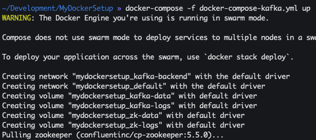

# Confluent Kafka stack
This docker compose will setup up the entire Confluent Kafka stack on Docker. Currently the docker-compose exposes the Kafka broker on port `9092`. However, this Kafka broker can only be accessed if the `EXTERNAL_NETWORK` setting in the docker-compose is an FQDN pointing at the Kafka instance.

To make the Kafka instance only accessible by the Docker network:
Replace:
```
KAFKA_LISTENER_SECURITY_PROTOCOL_MAP: PLAINTEXT:PLAINTEXT,EXTERNAL_NETWORK:PLAINTEXT
KAFKA_ADVERTISED_LISTENERS: PLAINTEXT://broker:29092,EXTERNAL_NETWORK://kafka.hackinglab.local:9092
```
With:
```
KAFKA_LISTENER_SECURITY_PROTOCOL_MAP: PLAINTEXT:PLAINTEXT
KAFKA_ADVERTISED_LISTENERS: PLAINTEXT://kafka:29092
```
Remove:
```
ports:
  - 9092:9092
networks: 
      - default
```

## Generate OpenSSL certs
1. If these do not exist
1. `openssl req -x509 -nodes -days 3650 -newkey rsa:2048 -keyout conf/ssl/docker.key -out conf/ssl/docker.crt`
1. `openssl dhparam -out conf/ssl/dhparam.pem 2048`

## Spin up stack
1. `docker-compose -f docker-compose-kafka.yml build`
1. `docker-compose -f docker-compose-kafka.yml up`
1. 

## References