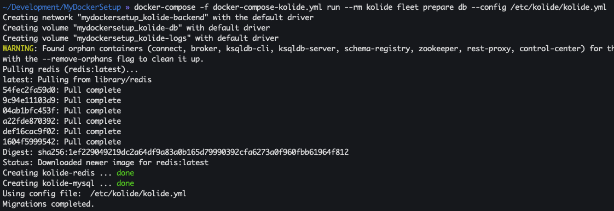
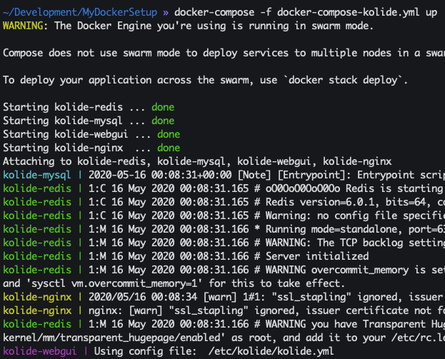

# Kolide stack
This docker compose will spin up Kolide Fleet which is used to manage Osquery hosts. However, the existence of this setup is to show how to use the `docker-compose run` command. Some tutorials will instruct you to spin up the Kolide stack, `docker exec` into Kolide, and run the `kolide fleet prepare db` command to initialize the database. This will demonstrate that method is unecessary.

## Set Kolide JWT key
This project has a pre-defined JWT key of `super_secret_key_here` which should ONLY BE used for testing. Below are instructions to make your own
1. `openssl rand -base64 32`
1. Copy key and paste in `conf/kolide/kolide.yml` as the value for `jwt_key`

## Spin up stack
1. `docker-compose -f docker-compose-kolide.yml build`
1. `docker-compose run --rm kolide fleet prepare db --config /etc/kolide/kolide.yml`
  1. 
1. `docker-compose -f docker-compose-kolide.yml up`
  1. 

## References
* [Github - Kolide Docker](https://github.com/CptOfEvilMinions/Kolide-Docker)