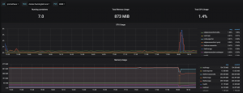

# Monitoring stack

This docker-compose will spin up InfluxDB, Prometheus, cAdvisor, node-exporter, and Grafana on your Docker machine. cAdvisor and node-exporter are the logging clients. Prometheus, Grafana, and InfluxDB are the seerveer portion where the metrics are ingested, stored, and analyzed.

## Credentials in `.env`
```
INFLUXDB_ADMIN_USER=admin
INFLUXDB_ADMIN_PASSWORD=Changeme123!
INFLUXDB_USER=telegraf
INFLUXDB_USER_PASSWORD=supersecretpassword
```

## Spin up stack
1. `docker-compose -f docker-compose-monitoring.yml build`
1. `docker-compose -f docker-compose-monitoring.yml up`

# Grafana dashboard
1. Open browser to `https://<Docker IP addr>:3000`
  1. Username: `admin`
  1. Password: `admin`

## Enable Prometheus
1. Settings > Data sources
1. Select "Data sources"
1. Select "Prometheus"
  1. Enter `http://prometheus:9090` into URL


## Add Docker dashboard
1. Download [Docker monitoring with node selection](https://grafana.com/grafana/dashboards/8321)
1. Select "Dashboard" on the left 
1. Select "Import"
1. Upload Dashboard you downloaded above
1. 
