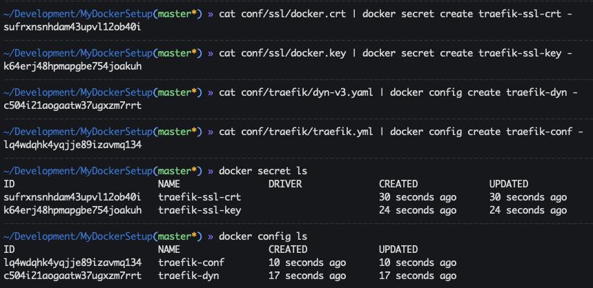
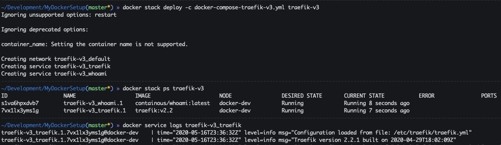
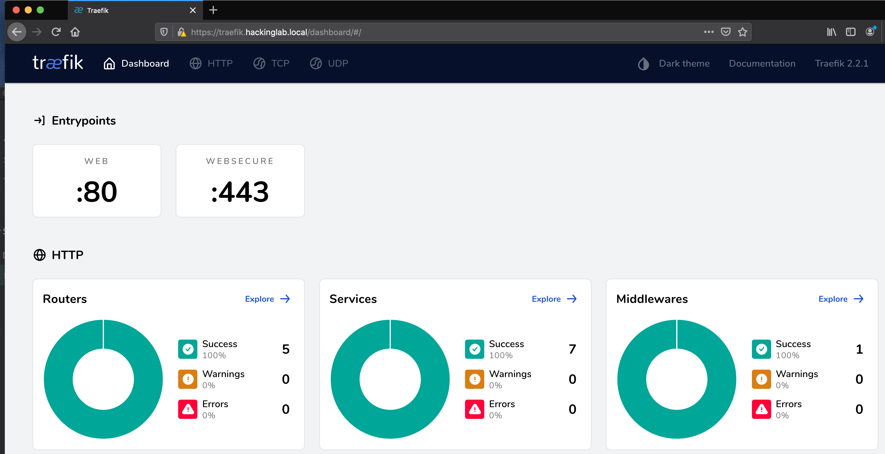

# Trefik example

This is an example for how to use Traefik as a dynamic reverse proxy for Docker containers. Traefik monitors the Docker sock (`/var/run/docker.sock`) to create dynamicc routing for new or expired containers. This `README.md` contains docker-compose files for `v2` and `v3` to show the differences between the versions. In addition to Traefik this stack is also coupled with the Docker container `whoami` which I use to ensure Traefik is working correctly.

## Docker v2 vs. v3
With `v2` we have to build a custom Docker image containing the SSL certs, config files, and etc. With `v3` we can use Docker secrets and configs to load them into the Traefik base image without the  need for a custom image.

## Tarefik + DNS
This Traefik setup is built on the premise you have a domain that `YOU` control and you want Traefik to route network traffic for. I have FreeIPA in my homelab being used to manage DNS and I have local domain of `hackinglab.local`. In my environment I have setup a wildccard A record of `*.hackinglab.local` to forward any subdomain to Treafik. 

## Generate OpenSSL certs
1. If these do not exist
1. `openssl req -x509 -nodes -days 3650 -newkey rsa:2048 -keyout conf/ssl/docker.key -out conf/ssl/docker.crt`
1. `openssl dhparam -out conf/ssl/dhparam.pem 2048`

## Docker-compose v2
1. `docker-compose -f docker-compose-traefik.yml build`
1. `docker-compose -f docker-compose-traefik.yml up`

## Docker-compose v3
This example shows how to use secrets, configs, networks, and Docker stack

1. `cat conf/ssl/docker.crt | docker secret create traefik-ssl-crt -`
1. `cat conf/ssl/docker.key | docker secret create traefik-ssl-key -`
1. `cat conf/traefik/dyn-v3.yaml | docker config create traefik-dyn -`
1. `cat conf/traefik/traefik.yml | docker config create traefik-conf -`
  1. 
1. `docker stack deploy -c docker-compose-traefik-v3.yml traefik-v3`
1. `docker stack ps traefik-v3`
1. `docker service logs traefik-v3_traefik`
  1. 
1. `curl -v -k https://localhost:8443 -H 'Host: whoami.mydockersetup'`

## Traefik dashboard
1. Open a browser to `https://traefik.<domain>/dashboard/` - YOU NEED THE END `/`
  1. 
  1. ![Traefik ]

## Access whoami
1. Open a browser to `https://whoami.hackinglab.local/`
1. `curl -k https://whoami.<domain>`
1. `curl -k https://<Docker IP addr>:443 -H  'Host: whoami.<domain>` - Only use this if you don't control a domain

## References
* [Docker secrets](https://docs.docker.com/compose/compose-file/#secrets)
* [docker service logs](https://docs.docker.com/engine/reference/commandline/service_logs/)