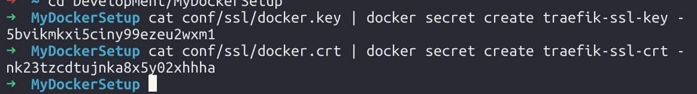

# Trefik example

## Generate SSL cert
1. `openssl req -x509 -sha256 -nodes -days 365 -newkey rsa:2048 -keyout conf/ssl/docker.key -out conf/ssl/docker.crt`

## Docker-compose v2
1. `docker-compose -f docker-compose-traefik.yml build`
1. `docker-compose -f docker-compose-traefik.yml up`
1. `curl -v -k https://localhost:8443 -H 'Host: whoami.mydockersetup'`

## Docker-compose v3
1. `cat conf/ssl/docker.crt | docker secret create traefik-ssl-crt -`
1. `cat conf/ssl/docker.key | docker secret create traefik-ssl-key -`
1. 
1. `cat conf/traefik/traefik-v3.toml | docker config create traefik-toml-conf -`
1. `docker stack deploy -c docker-compose-traefik-v3.yml traefik-v3`
1. `docker stack ps traefik-v3`
1. `docker service logs traefik-v3_traefik`
1. `curl -v -k https://localhost:8443 -H 'Host: whoami.mydockersetup'`

## References
* [Docker secrets](https://docs.docker.com/compose/compose-file/#secrets)
* [docker service logs](https://docs.docker.com/engine/reference/commandline/service_logs/)